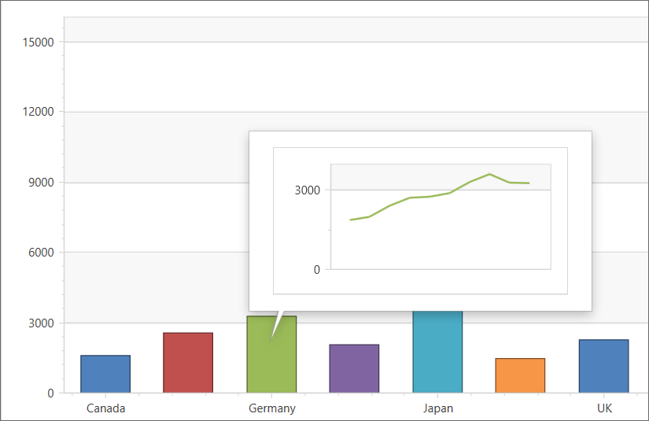

<!-- default badges list -->

<!-- default badges end -->
# Chart for WPF - How to Create a Custom Tooltip for a Series Point

This example implements a custom tooltip that displays another chart with a GDP history for the selected country when hovering over a bar.

## Implementation Details

The `System.Windows.DataTemplate` object specifies the custom tooltip appearance. The object is assigned to the [Series.ToolTipPointTemplate](https://docs.devexpress.com/WPF/DevExpress.Xpf.Charts.Series.ToolTipPointTemplate) property. The `GetDataSource()` and `GetGDPs()` methods supply charts with data from the GDP datasource. 

## Files to Review 
* [MainWindow.xaml](./CS/ToolTipPointTemplate/MainWindow.xaml) (VB: [MainWindow.xaml](./VB/ToolTipPointTemplate/MainWindow.xaml))
* [MainWindow.xaml.cs](./CS/ToolTipPointTemplate/MainWindow.xaml.cs) (VB: [MainWindow.xaml.vb](./VB/ToolTipPointTemplate/MainWindow.xaml.vb))

<!-- feedback -->
## Does this example address your development requirements/objectives?

 

(you will be redirected to DevExpress.com to submit your response)
<!-- feedback end -->
